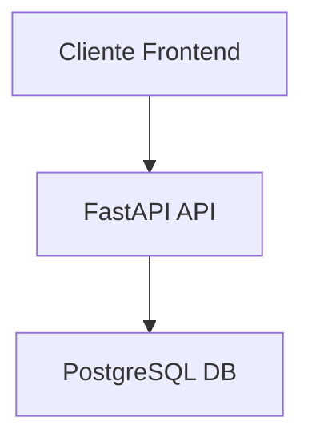
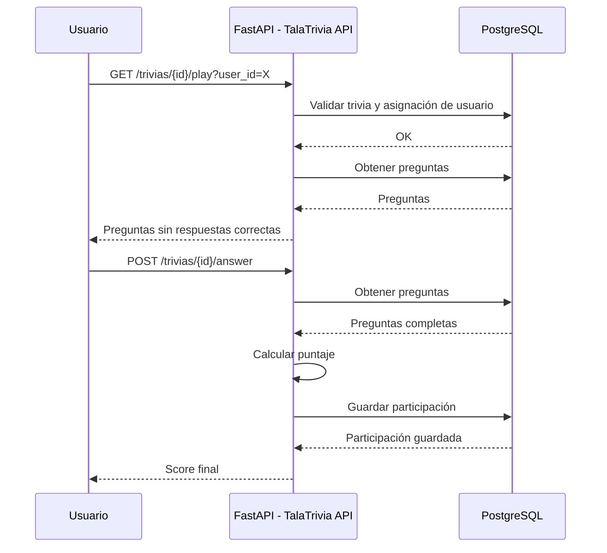
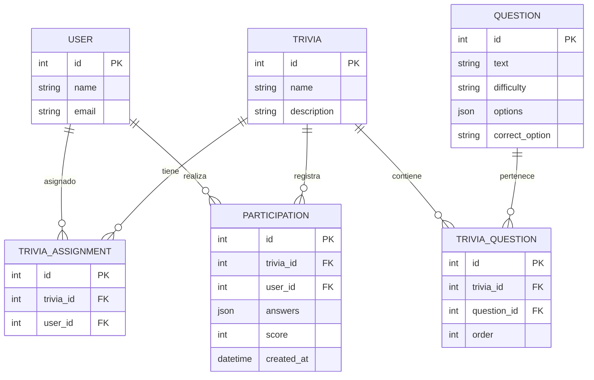
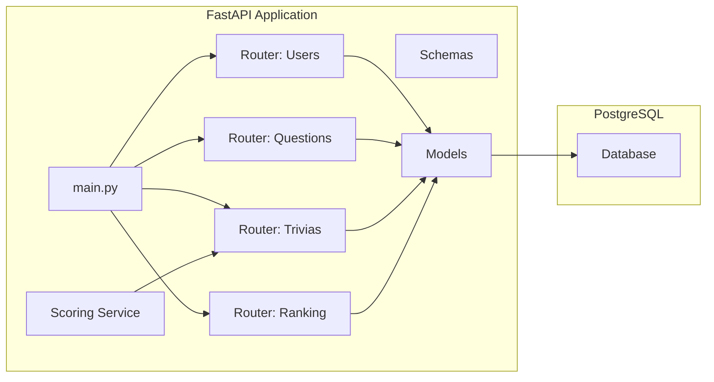

# TalaTrivia API

## Descripción del Proyecto

TalaTrivia es una API REST desarrollada con FastAPI, PostgreSQL y SQLAlchemy, diseñada para gestionar trivias de conocimiento. El sistema permite administrar usuarios, preguntas, trivias, participaciones y rankings de forma estructurada y eficiente. La aplicación está completamente dockerizada, permitiendo ejecutar tanto la base de datos como la API mediante Docker Compose.

## Diagrama de Arquitectura



## Diagrama de Secuencia – Flujo Jugar Trivia



## Diagrama ER



## Diagrama de Componentes



## Tecnologías Utilizadas

- Python 3.12 o superior  
- FastAPI  
- Uvicorn  
- SQLAlchemy ORM  
- PostgreSQL 14  
- Docker y Docker Compose  
- Pydantic v2  
- JSONB  

## Estructura del Proyecto

```
app/
├── main.py
├── database.py
├── models/
│   ├── user.py
│   ├── question.py
│   ├── trivia.py
│   ├── trivia_question.py
│   ├── trivia_assignment.py
│   ├── participation.py
│   └── __init__.py
├── schemas/
│   ├── user.py
│   ├── question.py
│   ├── trivia.py
│   ├── ranking.py
│   └── __init__.py
├── routers/
│   ├── users.py
│   ├── questions.py
│   ├── trivias.py
│   ├── ranking.py
│   └── __init__.py
└── services/
    └── scoring_service.py
```

## Ejecución con Docker

El proyecto está completamente dockerizado. Para construir y ejecutar la API y la base de datos:

```bash
docker-compose up -d --build
```

Para ver logs:

```bash
docker-compose logs -f api
```

Swagger UI disponible en:

```
http://localhost:8000/docs
```

## Ejecución en Local

Como alternativa, la API puede ejecutarse sin Docker:

```bash
python -m venv venv
source venv/Scripts/activate
pip install -r requirements.txt
uvicorn app.main:app --reload
```

## Endpoints Principales

- /users  
- /questions  
- /trivias  
- /ranking  

## Autor

Elvis Pérez  
Backend Developer
