# TalaTrivia API

## Descripción del Proyecto

**TalaTrivia** es una API REST desarrollada con **FastAPI**, PostgreSQL y SQLAlchemy, diseñada para administrar trivias de conocimiento, permitiendo:

- Registro de usuarios  
- Gestión de preguntas  
- Creación de trivias  
- Jugar trivias  
- Registrar participaciones  
- Generar ranking  

---

# 🏗️ Diagrama de Arquitectura

---

# 🎬 Diagrama de Secuencia – Flujo “Jugar Trivia”

```mermaid
sequenceDiagram
    participant U as Usuario
    participant API as FastAPI - TalaTrivia API
    participant DB as PostgreSQL

    U->>API: GET /trivias/{id}/play?user_id=X
    API->>DB: Validar trivia y asignación de usuario
    DB-->>API: OK
    API->>DB: Obtener preguntas
    DB-->>API: Preguntas
    API-->>U: Preguntas (sin respuestas correctas)

    U->>API: POST /trivias/{id}/answer
    API->>DB: Obtener preguntas
    DB-->>API: Preguntas completas
    API->>API: Calcular puntaje
    API->>DB: Guardar participación
    DB-->>API: Participación guardada
    API-->>U: Score final
```



---

# 🗂️ Diagrama ER (Entidad–Relación)


---

# 🧩 Diagrama de Componentes


---

# ⚙️ Tecnologías Utilizadas

- Python 3.12+
- FastAPI
- Uvicorn
- SQLAlchemy ORM
- PostgreSQL 14
- Docker & Docker Compose
- Pydantic v2
- JSONB

---

# 📂 Estructura del Proyecto

```text
app/
├── main.py
├── database.py
├── models/
│   ├── user.py
│   ├── question.py
│   ├── trivia.py
│   ├── trivia_question.py
│   ├── trivia_assignment.py
│   ├── participation.py
│   └── __init__.py
├── schemas/
│   ├── user.py
│   ├── question.py
│   ├── trivia.py
│   ├── ranking.py
│   └── __init__.py
├── routers/
│   ├── users.py
│   ├── questions.py
│   ├── trivias.py
│   ├── ranking.py
│   └── __init__.py
└── services/
    └── scoring_service.py
```

---

# 🐳 Cómo levantar PostgreSQL con Docker

```bash
docker-compose up -d
```

---

# ▶️ Ejecutar API en Local

```bash
python -m venv venv
source venv/Scripts/activate
pip install -r requirements.txt
uvicorn app.main:app --reload
```

Swagger 👉 http://127.0.0.1:8000/docs

---

# 📌 Endpoints

- `/users`
- `/questions`
- `/trivias`
- `/ranking`

---

# 🧠 Autor

**Elvis Pérez**  
Backend Developer  
